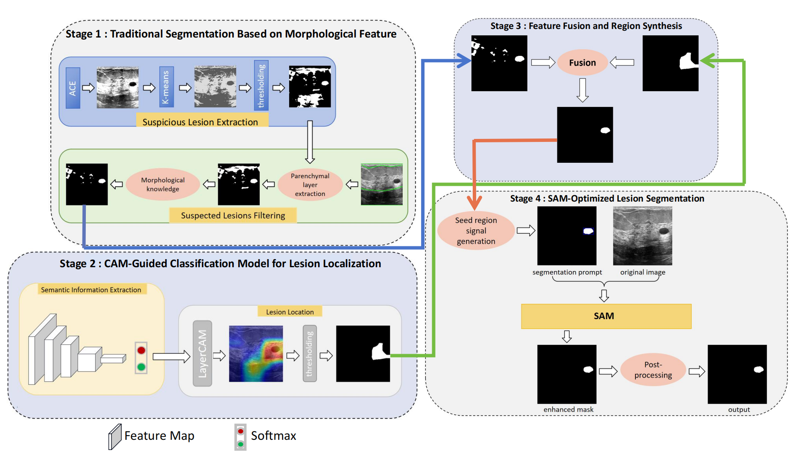

# MorSeg-CAM-SAM
## Introduction
We propose a novel weakly supervised breast lesion segmentation framework comprising four main modules: a traditional segmentation module based on morphology, a semantic information extraction and lesion localization module, an information fusion module, and a SAM fine-grained segmentation module. The traditional segmentation module utilizes morphology to perform initial segmentation and extract contour information from medical images, focusing on the shape, edge, and direction of lesions. The semantic information extraction and lesion localization module, leveraging image-level category labels, trains a classification network and achieves a fuzzy localization of lesions through the heat map provided by CAM. The information fusion module then adeptly combines the outputs from these two modules, generating a more comprehensive lesion area. Finally, SAM utilizes this area as a prompt for segmenting lesions, refining the segmentation process and enhancing the results through post-processing. 

